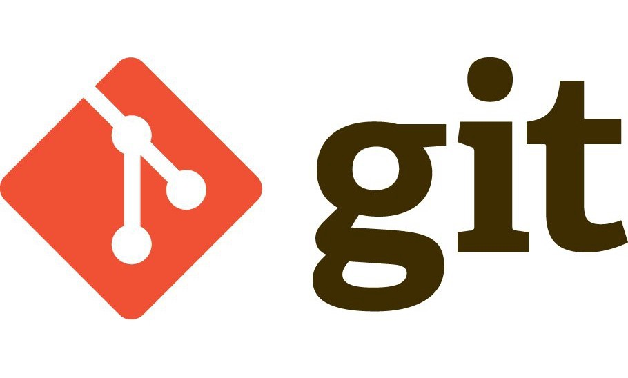
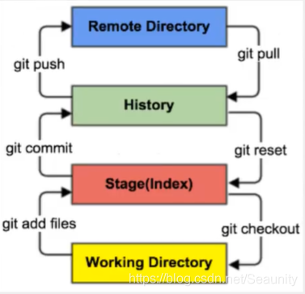

## 记录一些常用的知识点

### Git
一般常用的是Github desktop，所以对Git的命令并不是很熟悉，在这里记录下相关知识，用到的时候可以直接复制：



#### Git的应用目的和理论

目的是为了更好的版本控制。GIt本地有三个工作区域：工作目录（Working Directory），暂存区（Stage/Index），资源库（Repository）。外加上远程的git仓库（Remote Directory）。他们之间的关系如下所示：



#### git status

用于查看文件现存的状态。

Untracked：未追踪，已经新创建的文件，但没有添加到git库中，不接受版本控制，通过git add添加为Staged状态

Unmodify：未修改。文件已在git库中，没有修改，这个有两种状态可以改变，修改后会变为Modified状态；使用git rm命令会使其变为 Untracted状态。

Modified：文件已修改。通过git add命令使其进入暂存状态；或者通过git checkout变为unmodify状态。

Staged：暂存状态。git commit可以使文件同步到库中，变为unmodify的状态；通过git reset HEAD filename可以取消暂存，变为modified状态。

#### 忽略文件

.gitignore文件可以使用通配符来忽略一些文件

#### Git常用命令

```bash
git config -l #查看环境配置
git status #查看文件现存的状态

#推送流程(项目推送到远程仓库）

git add .
git commit -m "comment"
git push

#获得仓库
git pull 
#创建仓库，两种方法
git init #（初始化项目）
git clone [url] #克隆到远程仓库
```

### pip的镜像网址

- 中国科学技术大学 : https://pypi.mirrors.ustc.edu.cn/simple
- 豆瓣：http://pypi.douban.com/simple/
- 阿里云：http://mirrors.aliyun.com/pypi/simple/
- 清华：https://pypi.tuna.tsinghua.edu.cn/simple

